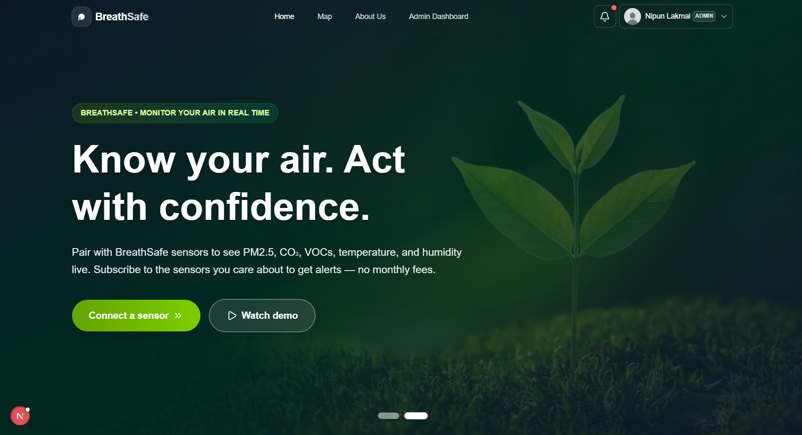

# 🌿 BreathSafe Frontend
BreathSafe - Advanced Air Quality & Health Monitoring Platform



## About

BreathSafe is an intuitive air quality monitoring and health management platform. Built with Next.js, it allows users to track air pollution levels in real time, view personalized health metrics, and receive immediate alerts. The frontend provides a seamless, mobile-friendly experience with rich data visualization and responsive controls.
## Features

- Real-time AQI display and historical trends

- Interactive charts for air quality and health metrics

- Location-based pollution monitoring

- Health alerts and personalized recommendations

- Clean, modern UI


## Technologies Used

- **Framework:** Next.js 15+ with TypeScript

- **State Management:** Zustand

- **HTTP:** Axios

- **UI & Styling:** Tailwind CSS, Lucide-React, React Icons

- **Forms:** Formik + Yup

- **Charts:** Chart.js

- **PDF & Export:** html2canvas-pro, jspdf-autotable

- **Notifications:** React Toastify

- **Utils:** use-debounce
## Installation

1. Clone the repository to your local machine:
```bash
git clone https://github.com/nipun-munasinghe/Breathsafe-App
```
2. Navigate to the project directory:
```bash
cd Breathsafe-App
```
3. Install and run:
```bash
npm install
npm run dev
```
4. Open http://localhost:3000 in your browser.
